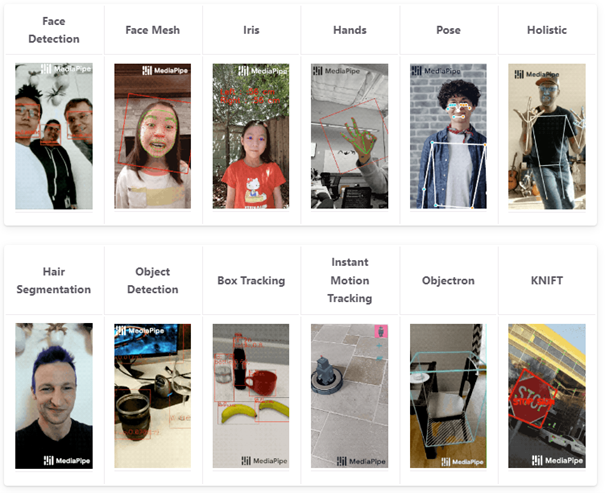

# Mediapipe Projesi

Mediapipe, Google tarafından geliştirilmiş ücretsiz ve açık kaynaklı bir makine öğrenmesi kütüphanesidir. Python, JavaScript, IOS ve Android desteği bulunmaktadır. Modüler yapısı sayesinde bize kullanımı kolay ve hızlı uygulanabilir bir yapı sunuyor. Bu kütüphane ile aşağıda görülen çeşitli konularda projeler üretebiliriz.




## İçindekiler
- [Özellikler](#özellikler)
- [Kurulum](#kurulum)
- [Örnekler](#örnekler)
- [Katkıda Bulunanlar](#katkıda-bulunanlar)


## Özellikler
- [Mediapipe](https://google.github.io/mediapipe/) kullanarak insanların vücut anahtar noktalarını ve elde ki anahtar noktaları tespit ediyoruz.

## Kurulum

    **Mediapipe ve OpenCV Kutuphanelerini yükleyin:**

    ```bash
    pip install mediapipe
    pip install opencv-python
    ```

## Örnekler

[vucut](images2.jpg)

[el](images3.jpg)

- **Görüntü:**

    [Görüntü bağlantısı veya eklenen görüntü dosyası]

## Katkıda Bulunanlar

- [Ömer Faruk Subaşı - GitHub profil bağlantınız]
